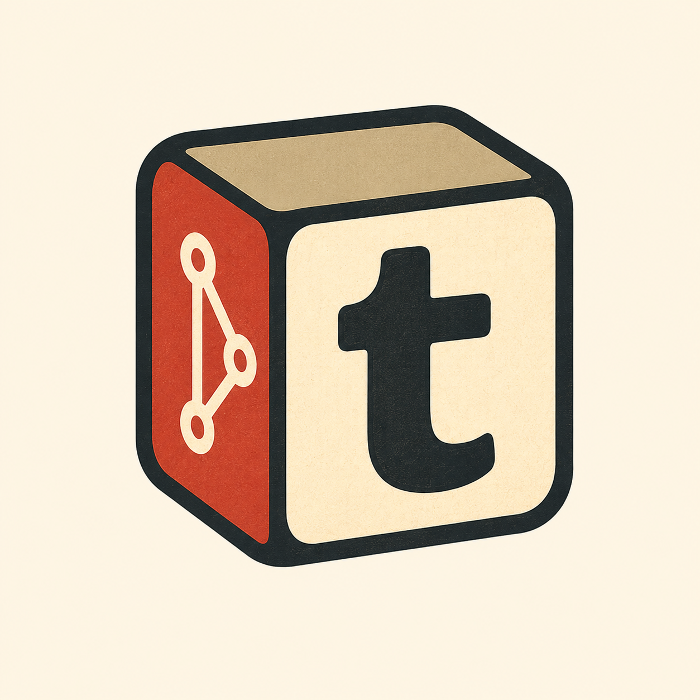

<div align="center">
  

  <h1>TyeGit</h1>
  <p><strong>The Git client that stays out of your way. Fast. Precise. Built in Rust.</strong></p>

  <p>
    
    
    
    
  </p>

  <p>
    <a href="https://www.producthunt.com/products/tyegit?embed=true&amp;utm_source=badge-featured&amp;utm_medium=badge&amp;utm_campaign=badge-tyegit" target="_blank" rel="noopener noreferrer">
      
    </a>
  </p>
  
  <p>
    <a href="https://github.com/VesperAkshay/tyegit/releases/latest">Download Latest Release</a>
    ·
    <a href="https://github.com/VesperAkshay/tyegit/issues">Report Bug</a>
    ·
    <a href="https://github.com/VesperAkshay/tyegit/issues">Request Feature</a>
  </p>
</div>

> ⚠️ **SECURITY ADVISORY:** Versions `v2.2.3` and below had a compromised auto-updater key accidentally leaked. **DO NOT** install or use them. Please only download and install `v2.3.0` or newer.

---

## 🚀 Overview

TyeGit is a lighting-fast, precision Git client built for developers who want the tactile speed of the CLI with the visual clarity of a GUI.

We abandoned bulky Electron and Chromium layers to build a sleek **Rust + Tauri** backend. This allows TyeGit to communicate directly with native Git binaries, ensuring instant repository loading, 60fps diff rendering, and an incredibly low memory footprint.

## ✨ Core Workflows

### 1. Surgical Precision
Stage line-by-line or by hunk using our embedded "God-Mode" diff editor. Open the index, edit code directly before committing, and maintain total control over your Git history.
If you made a mistake, instantly discard specific hunks using the **Revert Hunk** (`↺`) action directly from the margin.

### 2. Built-in Guardrails
We enforce fast-forward pulls by default and prevent accidental merges into protected branches. If timelines collide, TyeGit enters a dedicated `MERGE` state, flagging conflicting files so you can resolve them before disaster strikes.

### 3. Multi-Remote Mastery & Global Login
Manage upstream and origin effortlessly. Sync forks, push to multiple remotes, and track upstream branches with a single click. Authentic GitHub Device Flow authentication ensures secure, token-based network syncing.
Simply login globally from the Home screen to securely access and 1-click clone all your remote repositories without opening a local project first.

### 4. GitHub Actions Management
A built-in GitHub dashboard allows you to fully manage your repository and environment **Secrets, Variables, and Environments** natively within TyeGit. Secrets are securely encrypted locally via `libsodium` before being pushed to GitHub.

## 📊 How We Compare

TyeGit is designed to be the fastest tool for your daily staging and committing workflows.

| Feature | TyeGit | GitHub Desktop | GitKraken | Tower |
| :--- | :---: | :---: | :---: | :---: |
| **Open Source** | ✅ | ✅ | ❌ | ❌ |
| **Native App (No Electron)** | ✅ (Rust/Tauri) | ❌ | ❌ | ✅ |
| **Line-by-Line Staging** | ✅ | ❌ | ✅ | ✅ |
| **Editable Index (God-Mode)** | ✅ | ❌ | ❌ | ❌ |
| **Strict Fast-Forward Default** | ✅ | ❌ | ❌ | ❌ |
| **Visual Commit Graph** | ✅ (God-Mode) | ❌ | ✅ | ✅ |

*Note: Future development (v2.x) will expand on interactive rebasing and deep graph analysis to rival enterprise players.*

---

## 🛠️ Architecture

TyeGit utilizes a highly optimized **Inter-Process Communication (IPC)** bridge.
- **Frontend:** React 19, TypeScript, TailwindCSS v4, Framer Motion.
- **Backend:** Rust, Tauri 2.0, `git2-rs`.
- **Documentation:** Fumadocs.

The frontend is strictly responsible for rendering the UI and handling user interactions. It has no direct access to the filesystem. When you trigger an action, the frontend sends an IPC message to the Rust backend, which natively executes the highly-optimized Git operation and streams the new repository state back in fractions of a millisecond.

---

## 💻 Installation & Development

### Prerequisites
1. **Rust Toolchain:** Install via [rustup.rs](https://rustup.rs/).
2. **JavaScript Runtime:** Install [Bun](https://bun.sh/).
3. **Tauri CLI:** Follow the [Tauri Prerequisites guide](https://tauri.app/v1/guides/getting-started/prerequisites) for your OS.

### Building from Source

1. Clone the repository:
```bash
git clone https://github.com/VesperAkshay/tyegit.git
cd tyegit
```

2. Install dependencies:
```bash
bun install
```

3. Launch the development server:
```bash
bun run tauri dev
```

4. Launch the documentation website:
```bash
cd website
bun install
bun run dev
```

---

## 🤝 Contributing

Contributions are what make the open source community such an amazing place to learn, inspire, and create. Any contributions you make are **greatly appreciated**.

1. Fork the Project
2. Create your Feature Branch (`git checkout -b feature/AmazingFeature`)
3. Commit your Changes (`git commit -m 'Add some AmazingFeature'`)
4. Push to the Branch (`git push origin feature/AmazingFeature`)
5. Open a Pull Request

## 📝 License

Distributed under the MIT License. See `LICENSE` for more information.

<div align="center">
  <small>© 2026 TyeGit. Built with Tauri & Rust.</small>
</div>
